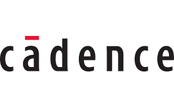
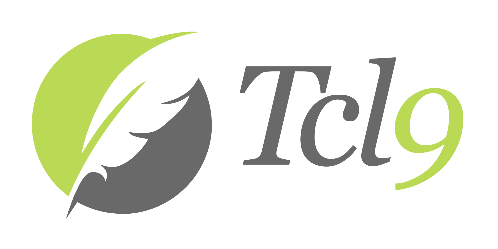
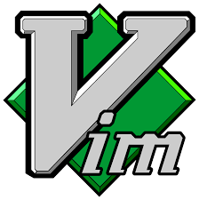

## Hi there 👋
I’m currently learning Cadence Innovus, Git, GNU/Linux, TCL, static timing analysis, Synopsys Design Constraints, and Vim.

<table border="0">
  <tr>
    <td align="center" width="200">
       
      <b>Git</b>
    </td>
    <td align="center" width="200">
       
      <b>Cadence</b>
    </td>
    <td align="center" width="200">
       
      <b>Tcl 9</b>
    </td>
    <td align="center" width="200">
       
      <b>Vim</b>
    </td>
  </tr>
</table>

<!--
**shovan-saha-primesiliconbd/shovan-saha-primesiliconbd** is a ✨ _special_ ✨ repository because its `README.md` (this file) appears on your GitHub profile.

Here are some ideas to get you started:

- 🔭 I’m currently working on ...
- 🌱 I’m currently learning tcl
- 👯 I’m looking to collaborate on Cadence Innovus 
- 🤔 I’m looking for help with ...
- 💬 Ask me about ...
- 📫 How to reach me: ...
- 😄 Pronouns: Male
- ⚡ Fun fact: ...
-->
